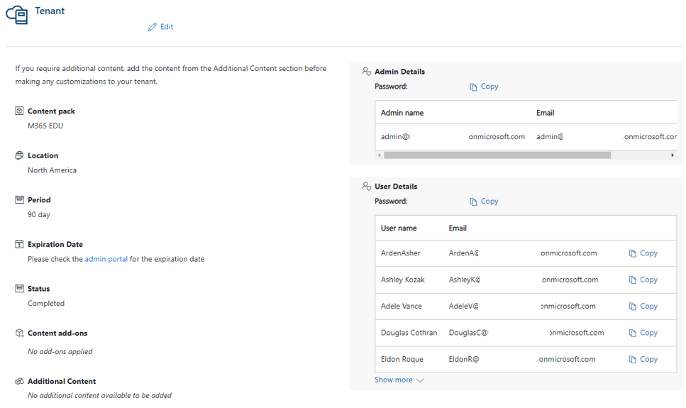

# Set up a demo education tenant

If you need a tenant for your personal learning or for customer demos, but not for developing education solutions, you can set up a demo EDU tenant instead of an EDU dev tenant.

You use your Microsoft Partner Network (MPN) ID and the [Customer Digital Experiences (CDX)](https://cdx.transform.microsoft.com/) to create a demo EDU tenant.

## Create a new demo education tenant

1. Go to the **My environments** tab.

2. On the **My tenants** tab, choose **Create tenant**. You can see the environment limits:

    - 90-day tenants: 0 of 6
    - 1-year tenants: 0 of 3
    - Custom tenants: 0 of 1

4. Select the tenant type from the following:
    - **Quick tenant:** A pre-provisioned custom Microsoft 365 tenant. These tenants contain the same robust demo content and add-on options (such as EMS, PSTN calling, and so on) that custom tenants have but without the wait. The Microsoft 365 tenant is immediately available; however, the add-ons content is provisioned only upon request.
    - **Custom tenant:** Only available for Microsoft users (@microsoft.com). With a custom tenant, you can customize the following:
Tenant name, Country/Region, Notification email, any of the demo personas. Custom tenants won't start the provisioning process until you choose **Finish**.
Standard Microsoft 365 tenants take approximately 12-48 hours to provision (not including add-ons). Dynamics 365 tenants take approximately 24-60 hours to provision.

5. Select the tenant period from the following.
    - **90 days:** 90 day tenants include the latest services and content at time of provisioning. This is the recommended option for specific customizations related to a customer engagement. 90 day tenants won't be extended.
    - **1 year:** One year tenants include the latest services and content at time of provisioning. This is the recommended option for customization and learning, such as creating hybrid environments. Only one year tenants can be extended. If a tenant is required long term, this is the best choice.
        > After one year, you need to [get new codes to renew](https://aka.ms/edupartnerportal).

6. Look for **Microsoft Education Demo Content** and choose **Create tenant**.

7. Accept the terms of use.

    > **Important:** You must not use a demo EDU tenant for development purposes.

8. When the tenant is created, the tenant details are displayed.

    

## Set up user licenses

For information about tenant licensing and user permissions, see the following:

- [Understand subscriptions and licenses](/microsoft-365/commerce/licenses/subscriptions-and-licenses?view=o365-worldwide&preserve-view=true)
- [Assign licenses to users](/microsoft-365/admin/manage/assign-licenses-to-users?view=o365-worldwide&preserve-view=true)
- [Unassign licenses from users](/microsoft-365/admin/manage/remove-licenses-from-users?view=o365-worldwide&preserve-view=true)
- [Buy or remove licenses from your subscription](/microsoft-365/commerce/licenses/buy-licenses?view=o365-worldwide&preserve-view=true)

## Next steps

- [Set up School Data Sync](/graph/msgraph-onboarding-sds)

## Related content

- [Set up an EDU dev tenant](/graph/msgraph-onboarding-devtenant).
